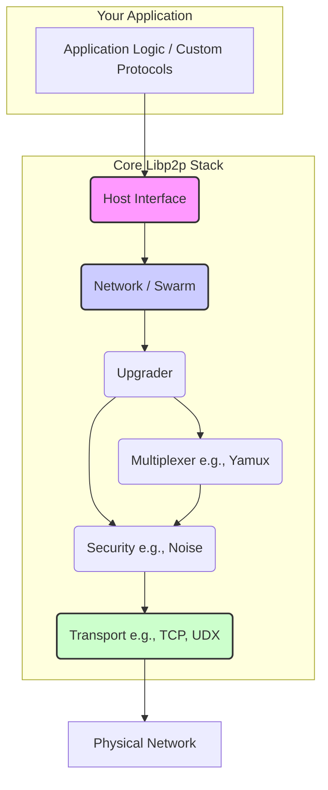

# Architecture Overview

Understanding the architecture of `dart-libp2p` is key to using it effectively. The library is designed to be modular, with components that can be swapped and configured to suit different needs. This document provides a high-level overview of the core components and how they interact.

## The Libp2p Stack

The libp2p stack can be visualized as a series of layers, where each layer provides services to the one above it. Data flows down the stack for outgoing communication and up the stack for incoming communication.

### Core Components

-   **Host**: The central entry point for your application. It ties all the other components together and provides the main API for interacting with the libp2p network.

-   **Network / Swarm**: The brain of the stack. The `Swarm` is the concrete implementation of the `Network` interface. It manages connections, peers, and the lifecycle of the upgrade process.

-   **Upgrader**: Responsible for upgrading raw, insecure connections into fully featured, secure, and multiplexed connections. It orchestrates the negotiation of security protocols and stream multiplexers.

-   **Transport**: The foundation of the stack. Transports like `TcpTransport` or `UdxTransport` are responsible for establishing the initial raw connections over the physical network.

-   **Security**: The security layer, with `NoiseSecurity` as the default, secures the raw connection by encrypting all communication and authenticating the remote peer's identity.

-   **Multiplexer**: The multiplexing layer, with `YamuxSession` as the default, takes a single secure connection and allows multiple independent, concurrent streams to run over it.

-   **Application / Protocols**: This is where your application logic lives. You define `StreamHandler` functions to handle incoming streams for your custom protocols.
